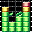

#  BambooTracker
[](https://github.com/rerrahkr/BambooTracker/releases)

[](https://travis-ci.org/rerrahkr/BambooTracker)
[](https://ci.appveyor.com/project/rerrahkr/bambootracker)
[](./LICENSE)


このアプリケーションはNEC PC-8801/9801シリーズに搭載されていたFM音源YM2608(OPNA)向けのトラッカーです。

[English](./README.md)

## ダウンロード
**Windows**:

- <https://github.com/rerrahkr/BambooTracker/releases>
- *開発版*: [Appveyor](https://ci.appveyor.com/project/rerrahkr/bambootracker)から"Artifacts"をダウンロード

**macOS**:

- <https://github.com/rerrahkr/BambooTracker/releases>

**Linux**:

- "Linuxでのビルド方法" - "DebianまたはUbuntuでのパッケージのインストール"の章を参照してください。

## Wiki
日本語版Wikiは[こちら](https://github.com/rerrahkr/BambooTracker/wiki/%E3%83%9B%E3%83%BC%E3%83%A0)です。

## 用語解説
トラッカーで作成される1データ(ファイル)をモジュールと呼びます。モジュールは複数のソング(曲データ)とインストゥルメント(音色)、各ソング共通の設定を持ちます。  
ソング中では各音源のチャンネルがトラックに割り当てられ、トラックはパターン(演奏パターン)を複数保持します。  
パターンはソングのオーダーに登録することで演奏されます。オーダーはリストになっており、先頭から順に演奏されていきます。  
パターンはステップが時系列順に並ぶ構造をしています。ノートオン/オフやほとんどのエフェクトはステップ単位で記述されます。  
ティックは最小の演奏単位で、1ステップ=nティックといった関係になります。カウント単位で変化する効果(ビブラートなど)はティックを基準にしています。

## インターフェース概要
### インストゥルメントリスト
インストゥルメントリストではモジュールで使用されるインストゥルメント(音色データ)を管理します。モジュール内の全てのソングはここに登録されているインストゥルメントを共有します。インストゥルメントは最大で128個登録できます($00-7F)。

### インストゥルメントエディタ
インストゥルメントをダブルクリックするとインストゥルメントエディタが開き、そのインストゥルメントを編集することができます。  
インストゥルメントはその設定(プロパティ)を他のインストゥルメントと共有することができます。プロパティを共有しているインストゥルメントは各プロパティ内のUsersに番号が表示されます。

インストゥルメントエディタには演奏シーケンスを設定できるものがあります。シーケンスエディタは1列が1ティックに対応しています。  
またシーケンスのループ/リリースポイントの指定にも対応しています。左クリックでポイント作成またはカウント増加/タイプ変更、右クリックでポイント削除またはカウント減少します。ポイントのエッジをドラッグすることで位置を移動できます。  
リリースのタイプはSSGのエンベロープ設定のみ以下の3種類から選択できます。

- Fixed: キーオフ時にリリースポイントから指定通りの音量で実行
- Absolute: キーオフ時の音量に到達するリリースポイント後の最初の地点から実行
- Relative: キーオフ時に音量を最大音量としてリリースポイントから実行

#### FMエディタ
FMエディタでは、

1. エンベロープ
2. LFO
3. オペレーターシーケンス
4. アルペジオ
5. ピッチ

のプロパティを設定できます。

エンベロープはMMLなどのテキストデータを貼り付けして読み込むことができます。テキストフォーマットは設定で追加・変更を行うことができます。デフォルトではFMP、FMP7、MMLDRV、MUCOM88、MXDRV、NRTDRV(`VOICE_MODE=0`)、PMD、VOPMが登録されています。  
この機能ではテキスト中の数字を出現順に読み込んでいきます。デフォルトのフォーマットを使用する際には予め音色名、コメントに含まれる数字を削除する必要があります。

#### SSGエディタ
SSGエディタでは、

1. 波形
2. トーン/ノイズ
3. エンベロープ
4. アルペジオ
5. ピッチ

のプロパティを設定できます。  
矩形波以外の波形を使用している間はソフトウェアエンベロープは無効になります。

### オーダーリスト
オーダーリストではパターン番号を演奏する順番に登録していきます。行がオーダー、列がトラックに対応しています。
リストの最大長は256($FF)です。

### パターンエディタ
パターンエディタではノートオンなどのイベントを時系列順に登録していきます。行はステップを表します。列はトラック毎に左から

1. 音符
2. インストゥルメント番号
3. 音量
4. エフェクト1の前2文字
5. エフェクト1の後2文字
6. エフェクト2の前2文字
7. エフェクト2の後2文字
8. エフェクト3の前2文字
9. エフェクト3の後2文字
10. エフェクト4の前2文字
11. エフェクト4の後2文字

を表しています。エフェクト2-3はヘッダーの+, -ボタンで表示/非表示を選択できます。  
パターンはトラックごとに最大で256個($00-FF)まで作成できます。

### 設定フィールド
設定フィールドでは、モジュールのメタデータやソングの演奏についての設定が行えます。

#### Tempo
ソングのテンポを指定します。なお、ここでのテンポはbpmとは異なり、単に早さの指標です。  
0Fxxエフェクトで指定することもできます。

#### Speed
1ステップにおける目安のティック数を設定します。Tempoによってこの値は実行時に変化することがあります。  
0Fxxエフェクトで指定することもできます。

#### Pattern size
デフォルトのパターン中のステップの個数を設定します。最小値は1、最大値は256です。

#### Groove
グルーヴエディタで設定したグルーヴ番号を指定します。グルーヴを利用する場合、他の演奏速度の設定はすべて固定されます。  
0Oxxエフェクトで指定することもできます。

## ショートカット
macosでは一部のキーを以下のものに置き換えてください。

- Ctrl → Command
- Alt → Option

### 全般
| キー   | コマンド                                   |
| ------ | ------------------------------------------ |
| Ctrl+N | モジュール新規作成                         |
| Ctrl+O | モジュールを開く                           |
| Ctrl+S | モジュール保存                             |
| Ctrl+P | モジュール設定                             |
| Ctrl+I | 選択中のインストゥルメントのエディタを開く |
| Return | 再生/停止                                  |
| Space  | Jam/Editモード切替                         |
| F1     | エフェクトリストダイアログを開く           |
| F2     | パターンエディタへ移動                     |
| F3     | オーダーリストへ移動                       |
| F4     | インストゥルメントリストへ移動             |
| F5     | Songの最初から再生                         |
| F6     | パターンを再生                             |
| F7     | カーソル位置から再生                       |
| F8     | 停止                                       |
| F12    | 音声リセット                               |

### インストゥルメントリスト
| キー   | コマンド                                   |
| ------ | ------------------------------------------ |
| Insert | インストゥルメント追加                     |
| Delete | インストゥルメント削除                     |
| Ctrl+I | 選択中のインストゥルメントのエディタを開く |

### オーダーリスト
| キー     | コマンド                                               |
| -------- | ------------------------------------------------------ |
| Ctrl+C   | 選択範囲コピー                                         |
| Ctrl+V   | 貼り付け                                               |
| Ctrl+A   | 1回目:現在のトラックの全オーダ選択, 2回目:オーダ全選択 |
| Ctrl+D   | オーダーをコピーし次のオーダーとして挿入               |
| Alt+D    | 選択したパターンをクローンしてその位置に置き換える     |
| Home     | 最初のオーダーへジャンプ                               |
| End      | 最後のオーダーへジャンプ                               |
| PageUp   | 前へオーダージャンプ                                   |
| PageDown | 後ろへオーダージャンプ                                 |
| Insert   | オーダー挿入                                           |
| Delete   | 現在のオーダーを削除し詰める                           |
| Escape   | 選択解除                                               |

### パターンエディタ
| キー          | コマンド                                                                   |
| ------------- | -------------------------------------------------------------------------- |
| Ctrl+C        | 選択範囲コピー                                                             |
| Ctrl+X        | 選択範囲カット                                                             |
| Ctrl+V        | 貼り付け                                                                   |
| Ctrl+M        | Mix貼り付け                                                                |
| Ctrl+A        | 1回目:現在のパターン・トラックの全ステップ選択, 2回目:現在のパターン全選択 |
| Ctrl+G        | 選択範囲のコマンド補完                                                     |
| Ctrl+R        | 選択範囲のコマンドを逆転                                                   |
| Ctrl+F1       | 選択範囲または現在のノート半音下げる                                       |
| Ctrl+F2       | 選択範囲または現在のノート半音上げる                                       |
| Ctrl+F3       | 選択範囲または現在のノートオクターブ下げる                                 |
| Ctrl+F4       | 選択範囲または現在のノートオクターブ下げる                                 |
| Alt+F9        | 現在のトラックをミュート                                                   |
| Alt+F10       | 現在以外のトラックをミュート                                               |
| Alt+S         | 選択範囲のインストゥルメントを現在の物に変更                               |
| Alt+L         | 現在のトラックのエフェクト列の表示数を増やす                               |
| Alt+K         | 現在のトラックのエフェクト列の表示数を減らす                               |
| Tab           | 次のトラックへ移動                                                         |
| BackTab       | 前のトラックへ移動                                                         |
| Home          | パターンの最初のステップへジャンプ                                         |
| End           | パターンの最後のステップへジャンプ                                         |
| PageUp        | 前へステップジャンプ                                                       |
| PageDown      | 後ろへステップジャンプ                                                     |
| Ctrl+Up       | 前のハイライトされた1stステップへジャンプ                                  |
| Ctrl+Down     | 後ろのハイライトされた1stステップへジャンプ                                |
| Insert        | ステップ挿入                                                               |
| BackSpace     | 前のステップを削除し詰める                                                 |
| Delete        | 現在のステップのデータ削除                                                 |
| Escape        | 選択解除                                                                   |
| -             | キーオフ                                                                   |
| \* (テンキー) | 入力オクターブアップ/エコーバッファ番号選択                                |
| / (テンキー)  | 入力オクターブダウン/エコーバッファ番号選択                                |
| ^             | エコーバッファ                                                             |

音符はキーボードを鍵盤に見立てて入力します。

```
現在のオクターブ+1
 2 3  5 6 7  9
Q W ER T Y UI O

 現在のオクターブ
 S D  G H J  L
Z X CV B N M, .
```

## 音量値
|      | 最大 | 最小 |
| ---- | ---- | ---- |
| FM   | 7F   | 00   |
| SSG  | 00   | 0F   |
| Drum | 00   | 1F   |

FMの順番は逆転することができます。 (Configuration -> General -> Reverse FM volume order).

## パターンエフェクト
| エフェクト | FM                                                                                                                        | SSG                                                                           | ドラム                               |
| ---------- | ------------------------------------------------------------------------------------------------------------------------- | ----------------------------------------------------------------------------- | ------------------------------------ |
| 00xy       | アルペジオ (x[0-F]: 第2音, y[0-F]: 第3音)                                                                                 | アルペジオ                                                                    | -                                    |
| 01xx       | ポルタメント・アップ (xx[00-FF]: デプス)                                                                                  | ポルタメント・アップ                                                          | -                                    |
| 02xx       | ポルタメント・ダウン (xx[00-FF]: デプス                                                                                   | ポルタメント・ダウン                                                          | -                                    |
| 03xx       | トーン・ポルタメント (xx[00-FF]: デプス)                                                                                  | トーン・ポルタメント                                                          | -                                    |
| 04xy       | ビブラート (x[0-F]: ピリオド, y[0-F]: デプス)                                                                             | ビブラート                                                                    | -                                    |
| 07xy       | トレモロ (x[0-F]: ピリオド, y[0-F]: デプス)                                                                               | トレモロ                                                                      | -                                    |
| 08xx       | パン (xx: 00=無音, 01=右, 02=左, 03=中央)                                                                                 | -                                                                             | パン                                 |
| 0A0x       | ボリューム・スライドダウン (x[0-F]: デプス)                                                                               | ボリューム・スライドダウン                                                    | -                                    |
| 0Ax0       | ボリューム・スライドアップ (x[0-F]: デプス)                                                                               | ボリューム・スライドアップ                                                    | -                                    |
| 0Bxx       | ポジションジャンプ (xx: オーダ番号)                                                                                       | ポジションジャンプ                                                            | ポジションジャンプ                   |
| 0Cxx       | ソング・エンド (xx: 任意の値)                                                                                             | ソング・エンド                                                                | ソング・エンド                       |
| 0Dxx       | パターン・ブレーク (xx: 次のオーダの開始ステップ)                                                                         | パターン・ブレーク                                                            | パターン・ブレーク                   |
| 0Fxx       | スピード/テンポチェンジ (xx[00-1F]: スピード, [20-FF]: テンポ)                                                            | スピード/テンポチェンジ                                                       | スピード/テンポチェンジ              |
| 0Gxx       | ノート・ディレイ (xx[00-FF]: ディレイカウント)                                                                            | ノート・ディレイ                                                              | ノート・ディレイ                     |
| 0Hxy       | -                                                                                                                         | オートエンベロープ  (x[0-F]: シフト量 (x-8), y[0-F]: エンベロープ形状)        | -                                    |
| 0Ixx       | -                                                                                                                         | ハードウェアエンベロープ周期1 (xx[00-FF]: 上位バイト)                         | -                                    |
| 0Jxx       | -                                                                                                                         | ハードウェアエンベロープ周期2 (xx[00-FF]: 下位バイト)                         | -                                    |
| 0Oxx       | グルーブ (xx[00-FF]: グルーブ番号)                                                                                        | グルーブ                                                                      | グルーブ                             |
| 0Pxx       | デチューン (xx[00-FF]: xx-80だけデチューン)                                                                               | デチューン                                                                    | -                                    |
| 0Qxy       | ノート・スライドアップ (x[0-F]: カウント, y[0-F]: 半音数)                                                                 | ノート・スライドアップ                                                        | -                                    |
| 0Rxy       | ノート・スライドダウン (x[0-F]: カウント, y[0-F]: 半音数)                                                                 | ノート・スライドダウン                                                        | -                                    |
| 0Sxx       | ノート・カット (xx[01-FF]: ディレイカウント)                                                                              | ノート・カット                                                                | ノート・カット                       |
| 0Txy       | トランスポーズ・ディレイ (x[1-7]: ディレイカウント(上向き変化), [9-F]: x-8分ディレイカウント(下向き変化), y[0-F]: 半音数) | トランスポーズ・ディレイ                                                      | -                                    |
| 0Vxx       | -                                                                                                                         | トーン/ノイズ・ミックス (xx: 00=消音, 01=トーン, 02=ノイズ, 03=トーン&ノイズ) | マスターボリューム (xx[00-3F]: 音量) |
| 0Wxx       | -                                                                                                                         | ノイズ・ピッチ (xx[00-1F]: ピッチ)                                            | -                                    |
| Axyy       | ARコントロール (x[1-4]: オペレーター, yy[00-1F]: AR値)                                                                    | -                                                                             | -                                    |
| Dxyy       | DRコントロール (x[1-4]: オペレーター, yy[00-1F]: DR値)                                                                    | -                                                                             | -                                    |
| FBxx       | FBコントロール (xx[00-07]: フィードバック値)                                                                              | -                                                                             | -                                    |
| Mxyy       | ボリューム・ディレイ (x[1-F]: ディレイカウント, yy[00-FF]: 音量)                                                          | ボリューム・ディレイ                                                          | ボリューム・ディレイ                 |
| MLxy       | MLコントロール (x[1-4]: オペレーター, y[0-F]: ML値)                                                                       | -                                                                             | -                                    |
| RRxy       | RRコントロール (x[1-4]: オペレーター, y[0-F]: RR値)                                                                       | -                                                                             | -                                    |
| Txyy       | TLコントロール (x[1-4]: オペレーター, yy[00-7F]: TL値)                                                                    | -                                                                             | -                                    |

## ファイル入出力
### モジュール
.btm (BambooTracker module file)の読み込み・書き出しに対応しています。

### インストゥルメント
以下のフォーマットの読み込み対応しています。

- .bti (BambooTracker instrument file)
- .dmp (DefleMask preset file)
- .tfi (TFM Music Maker instrument file)
- .vgi (VGM Music Maker instrument file)
- .opni (WOPN instrument file)
- .y12 (Gens KMod dump file)
- .ins (MVSTracker instrument file)

また、FMエンベロープはプレーンテキストの読み込みにも対応しています。

書き出しは.btiのみ可能です。

### バンク
バンクは複数のインストゥルメントを1つのセットにまとめたものです。  
以下のフォーマットの読み込みに対応しています。

- .btb (BambooTracker bank file)
- .wopn (WOPN bank file)

書き出しは.btbのみ対応しています。

### エクスポート
以下のファイルにエクスポートが可能です。

- .wav (WAVE file)
- .vgm (VGM file)
- .s98 (S98 file)

## 言語
BambooTrackerでは以下の言語に対応しています。

- 英語 (デフォルト)
- フランス語
- 日本語

## Linuxでのビルド方法
Ubuntu 18.04:

### 必要なパッケージ
> make  
> Qt5 (qmake)  
> Qt5 Multimedia  
> Qt5 Multimedia plugins  
> libasound2

```bash
sudo apt-get install \
  build-essential \
  qt5-default qtmultimedia5-dev libqt5multimedia5-plugins \
  libasound2-dev
```

PulseAudioを使用する場合は`libpulse-dev`を、JACKを使用する場合は`libjack-dev`もインストールして下さい。

### コンパイル
```bash
cd BambooTracker
qmake
make
```

PulseAudioやJACKを使用する場合は、`qmake`に以下のオプションを付けて下さい。

- PulseAudio: `qmake DEFINES+=__LINUX_PULSE__`
- JACK: `qmake DEFINES+=__UNIX_JACK__`

## FreeBSDでのパッケージのインストールまたはビルド
### ビルド
To build the BambooTracker via FreeBSD ports
```bash
cd /usr/ports/audio/bambootracker
make install clean
```

### パッケージ
To install the package
```bash
pkg install bambootracker
```

## DebianまたはUbuntuでのパッケージのインストール
`apt-get install bambootracker`

## Changelog
*[CHANGELOG.md](./CHANGELOG.md)を参照してください。*

## License
このプログラム及びソースコードのライセンスははGNU General License Version 2です。

*[LICENSE](./LICENSE)とライブラリに関して[list.md](./licenses/list.md)も参照してください。*

## クレジット
このアプリの作成において、以下の方々にお世話になっております。ありがとうございます。

- Qt
- YM2608のエミュレーションコードに関してMAME開発チームさんとValley Bellさん
- ツールバーに使用しているアイコンに関してMark Jamesさん
- VGMファイルのフォーマットのドキュメントに関してVGMRipsチームの方々
- トラッカーのUIやルーチンに関して多くのトラッカー作成者様、特に0CC-FamiTrackerのHertzDevilさん、Deflemask TrackerのLeonardo Demartino (delek)さん、GoatTrackerのLasse Öörni (Cadaver)さん
- トラッカーのアイコンに関してDecidettoさん
- サンプル曲を提供してくださったmaakさん、SuperJet Spadeさん、Dippyさん
- サンプルインストゥルメントを提供してくださったpapiezakさん
- WOPNインストゥルメントのフォーマットファイルに関してVitaly Novichkov (Wohlstand)さん
- S98ファイルのフォーマットのドキュメントに関してRu^3さん
- SCCIライブラリに関してSCCI開発チームの方々
- RtAudioとRtMidiライブラリに関してGary P. Scavoneさん他
- Nuked OPN-Modエミュレーションに関してAlexey Khokholov (Nuke.YKT)さん、Jean Pierre Cimalandoさん
- nowideライブラリに関してArtyom Beilisさん
- フランス語翻訳に関してJean Pierre Cimalandoさん、Olivier Humbertさん
- そしてこのプロジェクトに手助けしてくださるみなさん!
