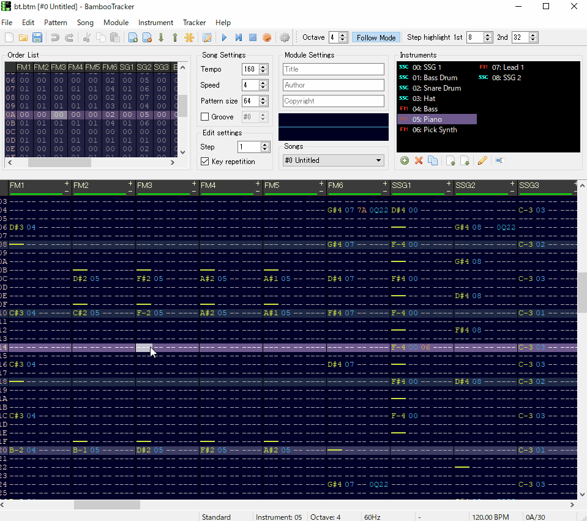

#  BambooTracker
[](https://github.com/rerrahkr/BambooTracker/releases)

[](https://travis-ci.com/rerrahkr/BambooTracker)
[](https://ci.appveyor.com/project/rerrahkr/bambootracker)
[](./LICENSE)



このアプリケーションはNEC PC-8801/9801シリーズに搭載されていたFM音源YM2608(OPNA)向けのトラッカーです。

[English](./README.md)

## ダウンロード
### Windows
- <https://github.com/rerrahkr/BambooTracker/releases>
- *開発版*: [Appveyor](https://ci.appveyor.com/project/rerrahkr/bambootracker)から"Artifacts"をダウンロード

### macOS
- <https://github.com/rerrahkr/BambooTracker/releases>

### Linux / BSD
#### Debian / Ubuntu
`apt install bambootracker`

#### FreeBSD
`pkg install bambootracker`

#### その他
- "ビルド方法"の章を参照してください。

## Wiki
WikiでBambooTrackerのインターフェースなどを説明しています。
日本語版Wikiは[こちら](https://github.com/rerrahkr/BambooTracker/wiki/%E3%83%9B%E3%83%BC%E3%83%A0)です。

## ショートカット
macOSでは一部のキーを以下のものに置き換えてください。

- Ctrl → command
- Alt → option
- BackSpace → delete
- Delete → fn+delete

### 全般
| キー        | コマンド                         |
| ----------- | -------------------------------- |
| Ctrl+N      | モジュール新規作成               |
| Ctrl+O      | モジュールを開く                 |
| Ctrl+S      | モジュール保存                   |
| Ctrl+P      | モジュール設定                   |
| Return      | 再生/停止                        |
| Space       | Jam/Editモード切替               |
| F1          | エフェクトリストダイアログを開く |
| F2          | パターンエディタへ移動           |
| F3          | オーダーリストへ移動             |
| F4          | インストゥルメントリストへ移動   |
| F5          | Songの最初から再生               |
| F6          | パターンを再生                   |
| F7          | カーソル位置から再生             |
| Ctrl+F7     | マーカー位置から再生             |
| Ctrl+Return | 現在のステップのみ再生           |
| F8          | 停止                             |
| F12         | 音声リセット                     |

### インストゥルメントリスト
| キー   | コマンド                                   |
| ------ | ------------------------------------------ |
| Insert | インストゥルメント追加                     |
| Delete | インストゥルメント削除                     |
| Ctrl+I | 選択中のインストゥルメントのエディタを開く |

### オーダーリスト
| キー              | コマンド                                               |
| ----------------- | ------------------------------------------------------ |
| Ctrl+C            | 選択範囲コピー                                         |
| Ctrl+V            | 貼り付け                                               |
| Ctrl+A            | 1回目:現在のトラックの全オーダ選択, 2回目:オーダ全選択 |
| Ctrl+D            | オーダーをコピーし次のオーダーとして挿入               |
| Alt+D             | 選択したパターンをクローンしてその位置に置き換える     |
| Home              | 最初のオーダーへジャンプ                               |
| End               | 最後のオーダーへジャンプ                               |
| PageUp            | 前へオーダージャンプ                                   |
| PageDown          | 後ろへオーダージャンプ                                 |
| InsertまたはAlt+B | オーダー挿入                                           |
| Delete            | 現在のオーダーを削除し詰める                           |
| Escape            | 選択解除                                               |

### パターンエディタ
| キー                                 | コマンド                                                                   |
| ------------------------------------ | -------------------------------------------------------------------------- |
| Ctrl+C                               | 選択範囲コピー                                                             |
| Ctrl+X                               | 選択範囲カット                                                             |
| Ctrl+V                               | 貼り付け                                                                   |
| Ctrl+M                               | Mix貼り付け                                                                |
| Ctrl+A                               | 1回目:現在のパターン・トラックの全ステップ選択, 2回目:現在のパターン全選択 |
| Ctrl+G                               | 選択範囲のコマンド補完                                                     |
| Ctrl+R                               | 選択範囲のコマンドを逆転                                                   |
| Ctrl+F1またはCtrl+スクロールアップ   | 選択範囲または現在のノート半音下げる                                       |
| Ctrl+F2またはCtrl+スクロールダウン   | 選択範囲または現在のノート半音上げる                                       |
| Ctrl+F3                              | 選択範囲または現在のノートをオクターブ下げる                               |
| Ctrl+F4                              | 選択範囲または現在のノートをオクターブ上げる                               |
| Shift+F1またはShift+スクロールアップ | 選択範囲または現在の数値を1下げる                                          |
| Shift+F2またはShift+スクロールダウン | 選択範囲または現在の数値を1上げる                                          |
| Shift+F3                             | 選択範囲または現在の数値を16下げる                                         |
| Shift+F4                             | 選択範囲または現在の数値を16上げる                                         |
| Alt+F9                               | 現在のトラックをミュート                                                   |
| Alt+F10                              | 現在以外のトラックをミュート                                               |
| Alt+Left                             | 前のインストゥルメントを選択                                               |
| Alt+Right                            | 次のインストゥルメントを選択                                               |
| Alt+S                                | 選択範囲のインストゥルメントを現在の物に変更                               |
| Alt+L                                | 現在のトラックのエフェクト列の表示数を増やす                               |
| Alt+K                                | 現在のトラックのエフェクト列の表示数を減らす                               |
| Ctrl+K                               | 現在の位置のブックマークを追加/削除                                        |
| Ctrl+B                               | マーカーを設定/削除                                                        |
| Alt+G                                | カーソル移動ダイアログ表示                                                 |
| Tab                                  | 次のトラックへ移動                                                         |
| BackTab                              | 前のトラックへ移動                                                         |
| Home                                 | パターンの最初のステップへジャンプ                                         |
| End                                  | パターンの最後のステップへジャンプ                                         |
| PageUp                               | 前へステップジャンプ                                                       |
| PageDown                             | 後ろへステップジャンプ                                                     |
| Ctrl+Up                              | 前のハイライトされた1stステップへジャンプ                                  |
| Ctrl+Down                            | 後ろのハイライトされた1stステップへジャンプ                                |
| Ctrl+PageUp                          | 前のブックマークへジャンプ                                                 |
| Ctrl+PageDown                        | 次のブックマークへジャンプ                                                 |
| Ctrl+Left                            | 前のオーダーへジャンプ                                                     |
| Ctrl+Right                           | 次のオーダーへジャンプ                                                     |
| InsertまたはAlt+Down                 | ステップ挿入                                                               |
| BackSpaceまたはAlt+Up                | 前のステップを削除し詰める                                                 |
| Delete                               | 現在のステップのデータ削除                                                 |
| Escape                               | 選択解除                                                                   |
| -                                    | キーオフ                                                                   |
| \* (テンキー)                        | 入力オクターブアップ/エコーバッファ番号選択                                |
| / (テンキー)                         | 入力オクターブダウン/エコーバッファ番号選択                                |
| ^                                    | エコーバッファ                                                             |

音符はキーボードを鍵盤に見立てて入力します。
キーボードの配置は環境設定で変更可能です。

```
現在のオクターブ+1
 2 3  5 6 7  9
Q W ER T Y UI O

 現在のオクターブ
 S D  G H J  L
Z X CV B N M, .
```

## パターンエフェクト
| エフェクト | FM                                                                                                                        | SSG                                                                           | ドラム                               | ADPCM                      | ADPCMドラムキット                                                                                                       |
| ---------- | ------------------------------------------------------------------------------------------------------------------------- | ----------------------------------------------------------------------------- | ------------------------------------ | -------------------------- | ----------------------------------------------------------------------------------------------------------------------- |
| 00xy       | アルペジオ (x[0-F]: 第2音, y[0-F]: 第3音)                                                                                 | アルペジオ                                                                    | -                                    | アルペジオ                 | -                                                                                                                       |
| 01xx       | ポルタメント・アップ (xx[00-FF]: デプス)                                                                                  | ポルタメント・アップ                                                          | -                                    | ポルタメント・アップ       | -                                                                                                                       |
| 02xx       | ポルタメント・ダウン (xx[00-FF]: デプス                                                                                   | ポルタメント・ダウン                                                          | -                                    | ポルタメント・ダウン       | -                                                                                                                       |
| 03xx       | トーン・ポルタメント (xx[00-FF]: デプス)                                                                                  | トーン・ポルタメント                                                          | -                                    | トーン・ポルタメント       | -                                                                                                                       |
| 04xy       | ビブラート (x[0-F]: ピリオド, y[0-F]: デプス)                                                                             | ビブラート                                                                    | -                                    | ビブラート                 | -                                                                                                                       |
| 07xy       | トレモロ (x[0-F]: ピリオド, y[0-F]: デプス)                                                                               | トレモロ                                                                      | -                                    | トレモロ                   | トレモロ                                                                                                                |
| 08xx       | パン (xx: 00=無音, 01=右, 02=左, 03=中央)                                                                                 | -                                                                             | パン                                 | パン                       | パン                                                                                                                    |
| 0A0x       | ボリューム・スライドダウン (x[0-F]: デプス)                                                                               | ボリューム・スライドダウン                                                    | -                                    | ボリューム・スライドダウン | ボリューム・スライドダウン                                                                                              |
| 0Ax0       | ボリューム・スライドアップ (x[0-F]: デプス)                                                                               | ボリューム・スライドアップ                                                    | -                                    | ボリューム・スライドアップ | ボリューム・スライドアップ                                                                                              |
| 0Bxx       | ポジションジャンプ (xx: オーダ番号)                                                                                       | ポジションジャンプ                                                            | ポジションジャンプ                   | ポジションジャンプ         | ポジションジャンプ                                                                                                      |
| 0Cxx       | ソング・エンド (xx: 任意の値)                                                                                             | ソング・エンド                                                                | ソング・エンド                       | ソング・エンド             | ソング・エンド                                                                                                          |
| 0Dxx       | パターン・ブレーク (xx: 次のオーダの開始ステップ)                                                                         | パターン・ブレーク                                                            | パターン・ブレーク                   | パターン・ブレーク         | パターン・ブレーク                                                                                                      |
| 0Fxx       | スピード/テンポチェンジ (xx[00-1F]: スピード, [20-FF]: テンポ)                                                            | スピード/テンポチェンジ                                                       | スピード/テンポチェンジ              | スピード/テンポチェンジ    | スピード/テンポチェンジ                                                                                                 |
| 0Gxx       | ノート・ディレイ (xx[00-FF]: ディレイカウント)                                                                            | ノート・ディレイ                                                              | ノート・ディレイ                     | ノート・ディレイ           | ノート・ディレイ                                                                                                        |
| 0Hxy       | -                                                                                                                         | オートエンベロープ (x[0-F]: シフト量 (x-8), y[0-F]: エンベロープ形状)         | -                                    | -                          | -                                                                                                                       |
| 0Ixx       | -                                                                                                                         | ハードウェアエンベロープ周期1 (xx[00-FF]: 上位バイト)                         | -                                    | -                          | -                                                                                                                       |
| 0Jxx       | -                                                                                                                         | ハードウェアエンベロープ周期2 (xx[00-FF]: 下位バイト)                         | -                                    | -                          | -                                                                                                                       |
| 0Oxx       | グルーブ (xx[00-FF]: グルーブ番号)                                                                                        | グルーブ                                                                      | グルーブ                             | グルーブ                   | グルーブ                                                                                                                |
| 0Pxx       | デチューン (xx[00-FF]: xx-80だけデチューン)                                                                               | デチューン                                                                    | -                                    | デチューン                 | -                                                                                                                       |
| 0Qxy       | ノート・スライドアップ (x[0-F]: カウント, y[0-F]: 半音数)                                                                 | ノート・スライドアップ                                                        | -                                    | ノート・スライドアップ     | -                                                                                                                       |
| 0Rxy       | ノート・スライドダウン (x[0-F]: カウント, y[0-F]: 半音数)                                                                 | ノート・スライドダウン                                                        | -                                    | ノート・スライドダウン     | -                                                                                                                       |
| 0Sxx       | ノート・カット (xx[01-FF]: ディレイカウント)                                                                              | ノート・カット                                                                | ノート・カット                       | ノート・カット             | ノート・カット                                                                                                          |
| 0Txy       | トランスポーズ・ディレイ (x[1-7]: ディレイカウント(上向き変化), [9-F]: x-8分ディレイカウント(下向き変化), y[0-F]: 半音数) | トランスポーズ・ディレイ                                                      | -                                    | トランスポーズ・ディレイ   | キーチェンジ・ディレイ (x[1-7]: ディレイカウント(上向き変化), [9-F]: x-8分ディレイカウント(下向き変化), y[0-F]: 半音数) |
| 0Vxx       | -                                                                                                                         | トーン/ノイズ・ミックス (xx: 00=消音, 01=トーン, 02=ノイズ, 03=トーン&ノイズ) | マスターボリューム (xx[00-3F]: 音量) | -                          | -                                                                                                                       |
| 0Wxx       | -                                                                                                                         | ノイズ・ピッチ (xx[00-1F]: ピッチ)                                            | -                                    | -                          | -                                                                                                                       |
| 0Xxx       | レジスタ番地指定 バンク0 (xx[00-B6]: 番地)                                                                                | レジスタ番地指定 バンク0                                                      | レジスタ番地指定 バンク0             | レジスタ番地指定 バンク0   | レジスタ番地指定 バンク0                                                                                                |
| 0Yxx       | レジスタ番地指定 バンク1 (xx[00-B6]: 番地)                                                                                | レジスタ番地指定 バンク1                                                      | レジスタ番地指定 バンク1             | レジスタ番地指定 バンク1   | レジスタ番地指定 バンク1                                                                                                |
| 0Zxx       | レジスタ値指定 (xx[00-FF]: レジスタ値)                                                                                    | レジスタ値指定                                                                | レジスタ値指定                       | レジスタ値指定             | レジスタ値指定                                                                                                          |
| Axyy       | ARコントロール (x[1-4]: オペレーター, yy[00-1F]: AR値)                                                                    | -                                                                             | -                                    | -                          | -                                                                                                                       |
| B0xx       | ブライトネス (xx[01-FF]: 相対値 (xx-80))                                                                                  |                                                                               |                                      | -                          | -                                                                                                                       |
| Dxyy       | DRコントロール (x[1-4]: オペレーター, yy[00-1F]: DR値)                                                                    | -                                                                             | -                                    | -                          | -                                                                                                                       |
| FBxx       | FBコントロール (xx[00-07]: フィードバック値)                                                                              | -                                                                             | -                                    | -                          | -                                                                                                                       |
| Mxyy       | ボリューム・ディレイ (x[1-F]: ディレイカウント, yy[00-FF]: 音量)                                                          | ボリューム・ディレイ                                                          | ボリューム・ディレイ                 | ボリューム・ディレイ       | ボリューム・ディレイ                                                                                                    |
| MLxy       | MLコントロール (x[1-4]: オペレーター, y[0-F]: ML値)                                                                       | -                                                                             | -                                    | -                          | -                                                                                                                       |
| RRxy       | RRコントロール (x[1-4]: オペレーター, y[0-F]: RR値)                                                                       | -                                                                             | -                                    | -                          | -                                                                                                                       |
| Txyy       | TLコントロール (x[1-4]: オペレーター, yy[00-7F]: TL値)                                                                    | -                                                                             | -                                    | -                          | -                                                                                                                       |

## ファイル入出力
### モジュール
.btm (BambooTracker module file)の読み込み・書き出しに対応しています。

### インストゥルメント
以下のフォーマットの読み込み対応しています。

- .bti (BambooTracker instrument file)
- .dmp (DefleMask preset file)
- .tfi (TFM Music Maker instrument file)
- .vgi (VGM Music Maker instrument file)
- .opni (WOPN instrument file)
- .y12 (Gens KMod dump file)
- .ins (MVSTracker instrument file)

また、FMエンベロープはプレーンテキストの読み込みにも対応しています。  
また、ADPCM波形エディターでは.wavファイルの読み込みに対応しています。(16-bit モノラル 2k-16kHzのみ)

書き出しは.btiのみ可能です。

### バンク
バンクは複数のインストゥルメントを1つのセットにまとめたものです。  
以下のフォーマットの読み込みに対応しています。

- .btb (BambooTracker bank file)
- .wopn (WOPN bank file)
- .ppc (PMD PPC file)
- .pvi (FMP PVI file)

書き出しは.btbのみ対応しています。

### エクスポート
以下のファイルにエクスポートが可能です。

- .wav (WAVE file)
- .vgm (VGM file)
- .s98 (S98 file)

## 言語
BambooTrackerでは以下の言語に対応しています。

- 英語 (デフォルト)
- フランス語
- 日本語

## ビルド方法
### 依存関係
BambooTrackerをビルドする際には以下の依存関係を用意してください。

- C++コンパイラ (GCC/Clang/...)
- make
- Qt5 Base
- Qt5 Multimedia
- Qt5 Multimedia plugins
- Qt5 Tools (qmake, lrelease, ...)

これらの取得方法はOSやディストーションによって異なります。

#### Windows
**TODO**
- MinGW / MSVC
- Qt5

#### macOS
ほとんどの場合、Xcode Command Line Toolsをインストールする必要があります。これらを取得する方法は、macOSのバージョンに依存する可能性があります。

Qt5については、[Homebrewを参照ください](https://formulae.brew.sh/formula/qt).

また、オプションとして以下の依存関係が存在します。

- **JACKのサポート**: JACK headers & libraries ([Homebrew](https://formulae.brew.sh/formula/jack))

#### Linux / BSD
通常は必要な依存関係はすべてディストリビューションのパッケージマネージャからインストールできます。

BambooTrackerをビルドするには以下の依存関係を用意してください。

- ALSA headers & libraries

また、オプションとして以下の依存関係が存在します。

- **PulseAudioのサポート**: PulseAudio headers & libraries
- **JACKのサポート**: JACK headers & libraries

##### Debian / Ubuntu:
```bash
apt install \
  build-essential \
  qt5-default qtmultimedia5-dev libqt5multimedia5-plugins qttools5-dev-tools \
  libasound2-dev \
  libpulse-dev libjack-dev
```

##### FreeBSD
FreeBSD Portsを通してビルドする場合は、"コンパイル" - "Linux / BSD" - "FreeBSD"を参照してください。

### コンパイル
通常、BambooTrackerのリリースは以下の手順で構築されます。

```bash
git clone https://github.com/rerrahkr/BambooTracker
cd BambooTracker
qmake CONFIG-=debug CONFIG+=release
make
```

#### Windows
**TODO**

- MinGWを使用する場合は、`make`の代わりに`mingw32-make` / `mingw64-make`を使用してください。
- MSVC *?*
- Qt Creatorによってより簡単にコンパイルすることが可能です。

#### macOS
HomebrewでJACKをインストールした場合、`qmake`に以下のJACKの指定を追加する必要になる可能性があります。  
`LIBS+=-L/usr/local/opt/jack/lib INCLUDEPATH+=/usr/local/opt/jack/include`

**JACKのサポート**を使用する際は、`qmake`に`DEFINES+=__UNIX_JACK__`のオプションを追加してください。

#### Linux / BSD
オプションの依存関係によって、`qmake`に以下のオプションを追加する必要があります。

- **PulseAudioのサポート**: `DEFINES+=__LINUX_PULSE__`
- **JACKのサポート**: `DEFINES+=__UNIX_JACK__`

##### FreeBSD
BambooTrackerはFreeBSD Portsを通してビルドすることが出来ます。

```bash
cd /usr/ports/audio/bambootracker
make install clean
```

### インストール
基本のファイル(実行ファイル+言語ファイル)は以下の手順でインストールされます。

```bash
make install
```

demos, skins, licensesなどその他のファイル、フォルダは適宜任意の場所へコピーしてください。

## 変更履歴
*[CHANGELOG.md](./CHANGELOG.md)を参照してください。*

## ライセンス
このプログラム及びソースコードのライセンスははGNU General License Version 2です。

*[LICENSE](./LICENSE)とライブラリに関して[list.md](./licenses/list.md)も参照してください。*

## クレジット
このアプリの作成において、以下の方々にお世話になっております。ありがとうございます。

- Qt
- YM2608のエミュレーションコードに関してMAME開発チームさんとValley Bellさん
- ツールバーに使用しているアイコンに関してMark Jamesさん
- VGMファイルのフォーマットのドキュメントに関してVGMRipsチームの方々
- トラッカーのUIやルーチンに関して多くのトラッカー作成者様、特に0CC-FamiTrackerのHertzDevilさん、Deflemask TrackerのLeonardo Demartino (delek)さん、GoatTrackerのLasse Öörni (Cadaver)さん
- トラッカーのアイコンに関してDecidettoさん
- サンプル曲を提供してくださったmaakさん、SuperJet Spadeさん、Dippyさん、RigidatoMSさん、ImATrackManさん
- サンプルインストゥルメントを提供してくださったpapiezakさん、阿保　剛さん
- WOPNインストゥルメントのフォーマットファイルに関してVitaly Novichkov (Wohlstand)さん
- S98ファイルのフォーマットのドキュメントに関してRu^3さん
- SCCIライブラリに関してがし３さん
- C86CTLライブラリに関してhonetさん
- RtAudioとRtMidiライブラリに関してGary P. Scavoneさん他
- Nuked OPN-Modエミュレーションに関してAlexey Khokholov (Nuke.YKT)さん、Jean Pierre Cimalandoさん
- フランス語翻訳に関してJean Pierre Cimalandoさん、Olivier Humbertさん
- ADPCMエンコーダ/デコーダに関してIan Karlssonさん
- そしてこのプロジェクトに手助けしてくださるみなさん!
